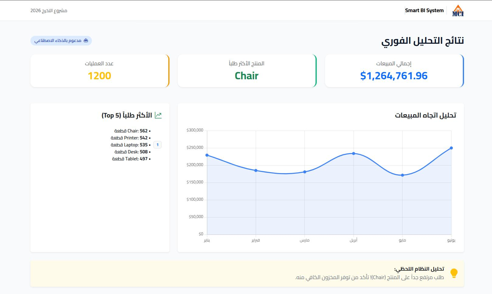
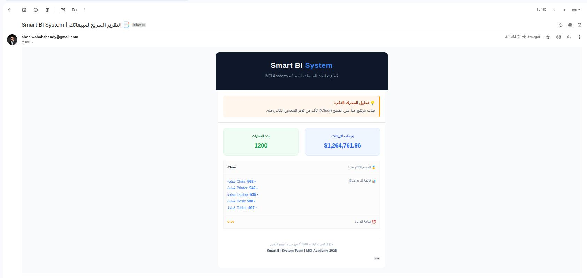
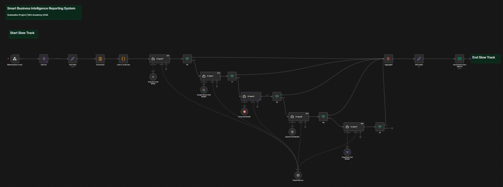
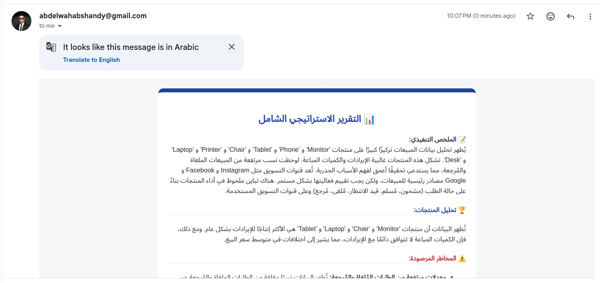

# 📊 Smart Business Intelligence Reporting System (Smart BI Project)

<p align="center">
  
</p>

<p align="center">
  <strong>Graduation Project – MCI Academy 2026</strong><br>
  An Automated, AI-powered Business Intelligence pipeline using <b>n8n</b>, <b>LLMs</b>, and <b>Excel</b>.
</p>

<p align="center">
  
  
  
  
</p>

---

## 🧠 Project Overview

The **Smart BI Reporting System** is an automated ecosystem designed to bridge the gap between raw data and executive decision-making. It transforms standard **Excel sales data** into high-level strategic insights through an **event-driven architecture**, simulating a professional data analyst's workflow.

The system features a dual-path processing engine:
* ⚡ **Fast Track**: Instant KPI extraction and real-time dashboard visualization.
* 🧠 **Slow Track**: Comprehensive AI-driven strategic analysis delivered directly to the executive's inbox.

---

## 🚀 Key Features

* **Agnostic Data Ingestion**: Upload any standard Excel sales file; the system adapts to the schema.
* **Dynamic Dashboard**: Real-time visual feedback using Chart.js/Bootstrap.
* **Security Gate**: Backend MIME-type validation to prevent malicious file uploads.
* **AI Strategic Reporting**: Full business analysis (SWOT, Trends, Forecasts) generated via LLMs.
* **Direct Outreach**: Automated multi-stage email delivery via SMTP.

---

## 🏗️ System Architecture

### 🔁 Workflow Orchestration
The core logic resides in **n8n**, where incoming Webhooks trigger parallel execution streams:

#### 1. Fast Track (Latency: < 2s)
* **Validation**: Strict MIME-type checking for data integrity.
* **Aggregation**: Real-time calculation of Total Revenue, Order Volume, and Top Products.
* **Delivery**: Updates the frontend via JSON and sends a "Quick Glance" email.

#### 2. Slow Track (Executive Intelligence)
* **Contextual Analysis**: Data is batch-processed and sent to an AI Agent (GPT-4o/Claude) for qualitative insights.
* **Strategic Email Delivery**: Instead of static files, the AI crafts a professional, structured email report containing SWOT analysis and actionable business recommendations.

---

## 🖥️ Project Showcase

### 1️⃣ Intelligent Dashboard
> **Operation Workflow:** From an empty state to a data-rich environment.

| Initial State | Processed Results |
| :---: | :---: |
|  |  |
| *Secure upload zone & RTL support* | *Real-time KPIs & Sales Trend Analysis* |

---

### 2️⃣ Fast Track Logic & Outreach
> **The Automation Backbone:** Visualizing the n8n logic and the immediate user feedback.

<div align="center">
  
  <p><i>n8n workflow handling ingestion and security validation.</i></p>
</div>

> **Instant Insight Email:**
<div align="center">
  
  <p><i>Automated HTML summary sent within seconds of upload.</i></p>
</div>

---

### 3️⃣ Slow Track (Strategic AI Analysis)
> **Advanced Intelligence:** The transition from raw numbers to executive-level strategy delivered via email.

<div align="center">
  
</div>

<details>
<summary><b>📧 Click to View Sample Strategic AI Email Report (Detailed)</b></summary>
<br>
<div align="center">
  
  <p><i>The final AI-generated strategic report, sent as a high-level executive email.</i></p>
</div>
</details>

---

## 🗂️ Project Structure

```bash
Smart-BI-Project/
├── Frontend/           # UI Components (HTML, CSS, Vanilla JS)
├── n8n-Workflows/      # Production-ready .json workflow exports
├── Samples/            # Standardized Excel datasets for testing
├── Manual Analysis/    # Comparison benchmarks and manual data audits
├── Presentation/       # Project pitch decks and academic documentation
├── Tasks/              # Development roadmap and sprint management
└── README.md           # Documentation

---

## 🧩 Technologies Used

* **n8n** – Automation & Backend Engine
* **JavaScript** – Data processing & logic
* **HTML / CSS** – Frontend UI
* **Excel (XLSX)** – Input data format
* **AI / LLMs** – Intelligent data interpretation
* **SMTP** – Automated email delivery

---

## 📊 Sample Data

The `Samples/` folder contains example Excel files for testing:

* `Customer-Purchase-History.xlsx`
* `Online-Store-Orders.xlsx`

You can use these files to test the system without creating your own dataset.

---

## ⚙️ Running the Project (Localhost)

### 1️⃣ Frontend

* Open `Frontend/index.html` in your browser
* Upload an Excel file and enter your email

### 2️⃣ n8n

* Run n8n locally (Docker or CLI)
* Import the workflow from:

  ```
  n8n-Workflows/The end of Fast Track(n8n).json
  ```
* Activate the workflow

---

## 🎓 Academic Value

This project demonstrates real-world concepts such as:

* Event-Driven Architecture
* Asynchronous Processing
* Automation Systems
* AI Integration in Business Intelligence
* Low-Code / No-Code Development

---

## 🎯 Use Case Scenario

1. User uploads Excel sales file
2. Instant insights appear on the website
3. Quick report is sent via email
4. Final AI-powered report arrives later

---

## 🏁 Core Idea

> **Transform raw Excel sales files into intelligent, automated, and actionable business reports using n8n and AI.**

---

## 👥 Project Team

- **Hamed Tarek**  
- **Howarah Ali Abdo**  
- **Sanaa Ahmed Mohamed**  
- **Abdelrahman Taher**  
- **Marwan Singer**  
- **Hadeer Abdelaziz**
- **Abdelwahab Shandy**  

_Graduation Project – MCI Academy 2026_

---

## 📌 Future Enhancements

* Cloud deployment
* Interactive dashboards
* Role-based access
* Multi-file analysis
* Real-time data sources

---

⭐ If you like this project, feel free to star the repository!
