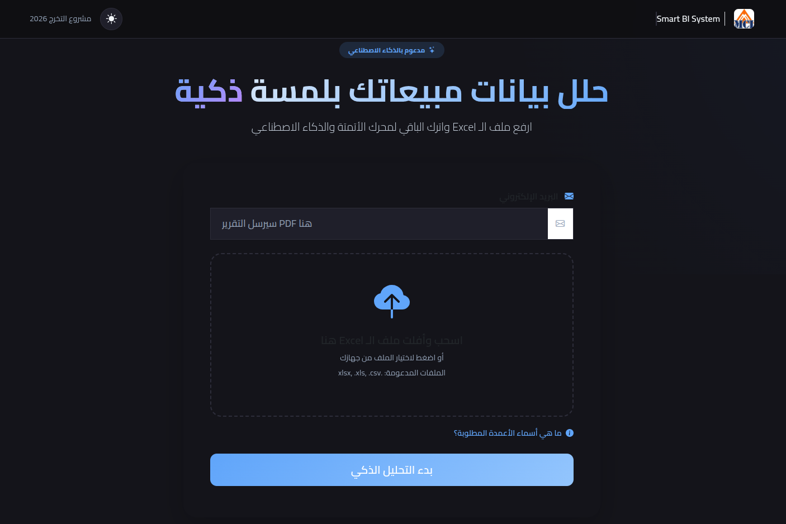
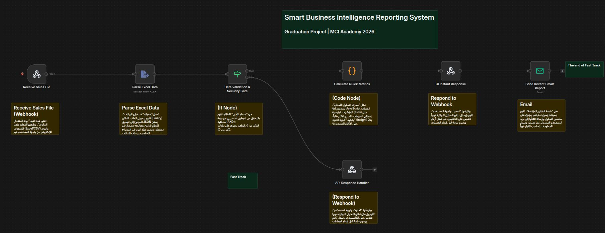

# 📘 Smart Business Intelligence Reporting System (Smart BI Project)

<p align="center">
  
</p>

<p align="center">
  <strong>Graduation Project – MCI Academy 2026</strong><br>
  Automated, AI-powered Business Intelligence reporting system using <b>n8n</b> and <b>Excel</b>.
</p>

<p align="center">
  
  
  
  
</p>

---

## 🧠 Project Overview

The **Smart Business Intelligence Reporting System** is an automated pipeline that transforms raw **Excel sales data** into **actionable insights**. It leverages an **event-driven, asynchronous architecture** to simulate the role of a **Senior Data Analyst**, processing data through two distinct paths:

* ⚡ **Fast Track**: Delivers instant KPIs and dashboard updates.
* 🧠 **Slow Track**: Conducts deep AI-driven statistical analysis and generates professional PDF reports.

---

## 🚀 Key Features

* **Flexible Schema**: Upload any standard Excel sales file.
* **Real-time Dashboard**: Instant visual feedback on sales trends.
* **Security First**: Backend MIME-type validation to ensure data integrity.
* **Automated Outreach**: Immediate email summaries sent via SMTP.
* **No-Backend Architecture**: Powered entirely by **n8n** as a logic engine.

---

## 🏗️ System Architecture

### 🔁 Event-Driven Workflow
The system captures data via a **Webhook** and forks the logic into two parallel streams:

#### ⚡ Fast Track (Instant Response)
* **Data Validation**: Checks for file content and correct `spreadsheet` MIME type.
* **KPI Engine**: Calculates Total Sales, Order Volume, and Top 5 Products.
* **Instant Feedback**: Returns JSON data to the Frontend and sends a summary email.

#### 🧠 Slow Track (Deep Analysis - In Progress)
* **AI Analysis**: Sends aggregated data to an LLM (e.g., GPT-4o) for SWOT and trend detection.
* **PDF Generation**: Crafts a professional report containing deep insights.

---

## 🖥️ Project Showcase

### 📊 Live Dashboard
 
*Current UI showing 2000 transactions and $2.2M+ in revenue.*

### ⚙️ n8n Fast Track Logic

*Visualizing the data ingestion and validation gate.*

---

## 🗂️ Project Structure

```bash
Smart-BI-Project/
├── Frontend/           # UI Components (HTML, CSS, JS)
├── n8n-Workflows/      # Exported .json workflow files
├── Samples/            # Test datasets for immediate evaluation
└── README.md           # Project documentation
```

---

## 🧩 Technologies Used

* **n8n** – Automation & Backend Engine
* **JavaScript** – Data processing & logic
* **HTML / CSS** – Frontend UI
* **Excel (XLSX)** – Input data format
* **AI / LLMs** – Intelligent data interpretation
* **SMTP** – Automated email delivery

---

## 📊 Sample Data

The `Samples/` folder contains example Excel files for testing:

* `Customer-Purchase-History.xlsx`
* `Online-Store-Orders.xlsx`
* `Retail-Store-Transactions.xlsx`

You can use these files to test the system without creating your own dataset.

---

## ⚙️ Running the Project (Localhost)

### 1️⃣ Frontend

* Open `Frontend/index.html` in your browser
* Upload an Excel file and enter your email

### 2️⃣ n8n

* Run n8n locally (Docker or CLI)
* Import the workflow from:

  ```
  n8n-Workflows/The end of Fast Track(n8n).json
  ```
* Activate the workflow

---

## 🎓 Academic Value

This project demonstrates real-world concepts such as:

* Event-Driven Architecture
* Asynchronous Processing
* Automation Systems
* AI Integration in Business Intelligence
* Low-Code / No-Code Development

---

## 🎯 Use Case Scenario

1. User uploads Excel sales file
2. Instant insights appear on the website
3. Quick report is sent via email
4. Final AI-powered PDF report arrives later

---

## 🏁 Core Idea

> **Transform raw Excel sales files into intelligent, automated, and actionable business reports using n8n and AI.**

---

## 👥 Project Team

- **Abdelwahab Shandy**  
- **Marwan Singer**  
- **Hamed Tarek**  
- **Doha Ñageh**   
- **Hadeer Abdelaziz**
- **Abdelrahman Taher**  
- **Howarah Ali Abdo**  

_Graduation Project – MCI Academy 2026_

---

## 📌 Future Enhancements

* Cloud deployment
* Interactive dashboards
* Role-based access
* Multi-file analysis
* Real-time data sources

---

⭐ If you like this project, feel free to star the repository!
